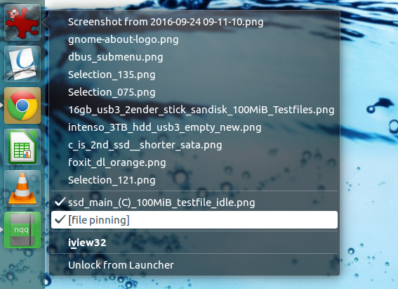

# ubuntu-recentquicklists

Finally, there is an automated recent-files quicklist script for Ubuntu, as Windows already has for quite some time.
It adds recent files (you can choose how many days old they might be) to the right-click on the unity-dash's launchers (locked-to-launcher-apps in taskbar) and allows to pin important files there permanently, as well.

If you're on Ubuntu Gnome, i.e. 17.10 or higher there is no Unity-based Taskbar anymore to host this, but Maestroschan got you covered: https://github.com/Maestroschan/quicklists-gnome-shell-extension

Please mind that the Wiki only supports the latest release, masterbranch-changes are documented in Changelog.md.

Installation & Autorun:
see https://github.com/thirschbuechler/ubuntu-recentquicklists/wiki/Installation
(in short: download/clone anywhere, make ubuntu-recentquicklists.py and install.sh executable, run install.sh)

Huge thanks to 
https://forum.ubuntuusers.de/topic/libreoffice-unity-dynamische-quicklist/ (german post), which provided the framework to expand the functionality from being limited to libreoffice to serve all applications.
Also, stackexchange (in particular stackoverflow) helped a lot.
